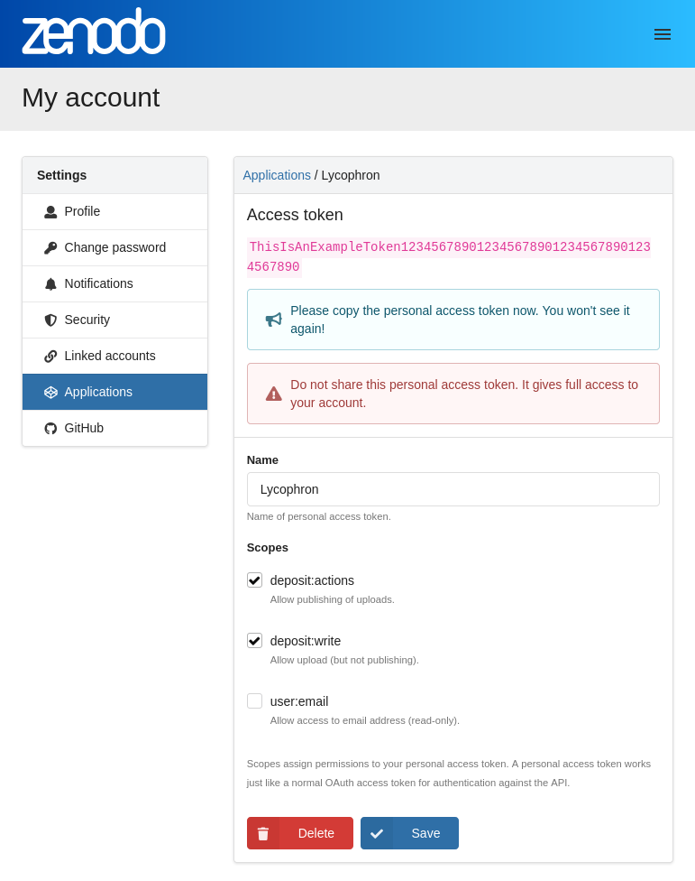

# Lycophron

Lycophron is a CLI tool to support batch uploads of records to Zenodo.

The tool supports the upload through CSV files that describe each record to be uploaded.

## Quickstart Guide

### Installation

Install from GitHub using [`uv`](https://github.com/astral-sh/uv):

```bash
uv tool install "lycophron @ git+https://github.com/plazi/lycophron@main"
```

To upgrade Lycophron:

```bash
uv tool upgrade lycophron
```

### Initalize a local project

Let's initalize a local project named `monkeys`:

```bash
lycophron init monkeys
```

> You will be prompted to input a Zenodo personal access token authentication token. You can leave it empty as this can be done afterward by directly editing the configuration file.

```bash
Zenodo token []:
```

List the project contents:

```bash
cd monkeys/

tree -F
./
├── files/
├── lycophron.cfg
└── lycophron.db
```

### Configure the project

Add or edit `TOKEN` and `ZENODO_URL` in `lycophron.cfg`.

In Zenodo (or Zenodo Sandbox), go to "My account" > "Applications", and under "Personal access tokens" click on the "New token" button:


Provide a name, define the scopes, and create the token:


Copy the generated access token:



Configure the token in the configuration file:

```bash
cat lycophron.cfg

TOKEN = 'CHANGE_ME'
ZENODO_URL = 'https://sandbox.zenodo.org/api'  # Zenodo Sandbox
# ZENODO_URL = 'https://zenodo.org/api'  # Zenodo Production
```

### Generate a template CSV import file

Generate a template with all the fields:

```bash
lycophron new-template --file data-all.csv --all
```

Or generate a template with specific custom fields (e.g. `dwc` and `ac`):

```bash
lycophron new-template --file data-dwc-ac.csv --custom "dwc,ac"
```

Or generate a template with minimal fields:

```bash
lycophron new-template --file data.csv --minimal
```

### Fill in metadata and load the file

Edit the CSV file, add one line per record, and load the records into the local project database with the following command:

```bash
lycophron load --file data.csv
```

### Publish to Zenodo

```bash
lycophron start
```

## Getting started

- [Installation](#installation)
- [Commands](#commands)
- [Configuration](#configuration)
- [Metadata](#supported-metadata)
- [How to create a CSV](#how-to-create-a-csv)
- [Development](#development)
- [Known issues](#known-issues)

## Installation

**Requirements**

- Python v3.11+

Install from GitHub using `pip` or [`pipx`](https://pipx.pypa.io/):

```bash
pipx install "lycophron @ git+https://github.com/plazi/lycophron.git@v1.0.0
```

> [!NOTE]
> In the future Lycophron will be published on PyPI and just require `pip install lycophron`.

### Linux/macOS

> It is recommended to use a virtual environment to install and run the application.
>
> To create a virtual environment named `lycophron`, run the following command in your terminal:
>
> ```shell
> python3 -m venv lycophron
> source lycophron/bin/activate
> ```

To install the CLI tool for development, clone this repository and run:

```shell
# For local development
uv pip sync requirements-dev.txt
uv pip install -e .[dev]
```

## Commands

**init**

This command initializes the project, creates necessary configuration files, and sets up a local database.

`init [name]`  : initialize the app with the given name
`init --token` : initialize the app with a token

>:warning: Adjust configurations in the generated files to meet specific upload requirements.

**validate**

This command validates the current project. I.e. it checks whether the application is properly configured, the directory structure is correct and the metadata is valid and ready to be loaded locally.

`validate --file` : validate the project and the given file.

**new-template**

This command generates a CSV file from the default template, containing all the required headers. The template can either be generated with all the fields or by explicitely adding custom fields on top of the required ones.

`new-template --file`                                       : creates the output file in the given path and name.
`new-template --all`                                        : creates a template using all fields (required and custom fields).
`new-template --custom "dwc,gbif-dwc,ac,dc,openbiodiv,obo"` : creates a template using the required fields plus the given custom fields.

**load**

This command loads records from a local file into the local Database, ensuring they are ready to upload to Zenodo.

`load --input`: load records from a given file to a local DB

**start**

Publishes the previously loaded records to Zenodo.

This command specifically targets records that are currently unpublished. Importantly, this operation is designed to be executed multiple times, allowing for a phased or incremental approach to publishing records as needed.

`start`: publish records to Zenodo


## Configuration

| name       | description                                                                                          |
| ---------- | ---------------------------------------------------------------------------------------------------- |
| TOKEN      | Token to authenticate with Zenodo                                                                    |
| ZENODO_URL | URL where to publish records (e.g. https://zenodo.org/api/deposit/depositions TODO THIS IS WRONG!!!) |

## Supported metadata

| name             | cardinality | data type                     | description                                |
| ---------------- | ----------- | ----------------------------- | ------------------------------------------ |
| description      | 1           | string                        | record's description                       |
| creators         | 1-N         | list of strings               | -                                          |
| title            | 1           | string                        | -                                          |
| keywords         | 0-N         | list of strings               | -                                          |
| access_right     | 0-1         | string                        | -                                          |
| upload_type      | 0-1         | string                        | -                                          |
| publication_type | 0-1         | string                        | -                                          |
| publication_date | 0-1         | ISO8601-formatted date string | -                                          |
| journal_title    | 0-1         | string                        | -                                          |
| journal_volume   | 0-1         | string                        | -                                          |
| journal_issue    | 0-1         | string                        | -                                          |
| journal_pages    | 0-1         | string                        | -                                          |
| communities      | 0-N         | list of strings               | -                                          |
| doi              | 0-1         | string                        | -                                          |
| files            | 0-N         | list of strings               | name of the files to upload for the record |

## How to create a .csv

- Generate the template by running `lycophron new-template` and fill in the metadata.
- File names must match the files under the directory `/files/`

> [!TIP]
> We also provide [a sample generated sheet import template](https://docs.google.com/spreadsheets/d/1TUyDT6yOypX2DBuM_PNUZucFTC93uFlEa7PoAMYvnDI/edit?gid=54078251#gid=54078251) with some pre-filled values.

> [!WARNING]
> When working with fields defined as a list in the CSV file, it is essential to separate each item with a new line ("\n"). This ensures proper formatting and accurate representation of the list structure in the CSV file, thus allowing Lycophron to parse the values correctly.

Example:

| title                                                                                                                         | description                                                                                                                     | access_right | upload_type | communities  | publication_type | publication_date | journal_title        | journal_volume | journal_issue | journal_pages | doi                        | creators.name                                                 | creators.affiliation                                                                                                | creators.orcid | keywords | files                | id          | dwc:eventID | related_identifiers.identifier                  | related_identifiers.relation  |
| ----------------------------------------------------------------------------------------------------------------------------- | ------------------------------------------------------------------------------------------------------------------------------- | ------------ | ----------- | ------------ | ---------------- | ---------------- | -------------------- | -------------- | ------------- | ------------- | -------------------------- | ------------------------------------------------------------- | ------------------------------------------------------------------------------------------------------------------- | -------------- | -------- | -------------------- | ----------- | ----------- | ----------------------------------------------- | ----------------------------- |
| LES NYCTERIDAE (CHIROPTERA) DU SÉNÉGAL: DISTRIBUTION, BIOMETRIE ET DIMORPHISME SEXUEL                                         | Cinq especes de Nycteridae sont preserves au Sénegal                                                                            | open         | publication | bats_project | article          | 1976-12-31       | Mammalia             | 40             | 4             | 597-613       | 10.1515/mamm.1976.40.4.597 | Adam, F. Hubert, B.                                           |                                                                                                                     |                |          | Adam_Hubert_1976.pdf | specimen001 |             | {doi:figure001} {doi:figure002} {doi:figure003} | Documents Documents Documents |
| New ecological data on the noctule bat (Nyctalus noctula Schreber, 1774) (Chiroptera, Vespertilionidae) in two towns of Spain | The Iberian Peninsula represents the South-western limit of distribution of thenoctule bat (<i>Nyctalus noctula</i>) in Europe. | open         | publication | bats_project | article          | 1999-01-31       | Mammalia             | 63             | 3             | 273-280       | 10.1515/mamm.1999.63.3.273 | Alcalde, J. T.                                                | Departamento de Zoología, Faculdad de Ciencias, Universidad de Navarra. Avda Irunlarrea s/n. 31080, Pamplona. Spain |                |          | Alcade_1999.pdf      | figure001   |             | {doi:speciment001}                              | isDocumentedBy                |
| ROOSTING, VOCALIZATIONS, AND FORAGING BY THE AFRICAN BAT, NYCTERIS THEBAICA                                                   | There is no abstract                                                                                                            | open         | publication | bats_project | article          | 1990-05-21       | Journal of Mammalogy | 71             | 2             | 242-246       | 10.2307/1382175            | Aldridge, H. D. J. N. Obrist, M. Merriam, H. G. Fenton, M. B. |                                                                                                                     |                |          |                      |             |             |                                                 |                               |

## Known issues

- DOIs are generated on demand, existing or external DOIs are not accepted. [issue](https://github.com/plazi/lycophron/issues/19)
- Metadata is compliant with legacy Zenodo, not RDM
- Output is not clear for the user. E.g. user does not know what to run next, how to fix issues with the data, etc.

## Cross-referencing records

You can use Jinja2 templates to create cross-references between records in your CSV. This allows one record to reference fields from another record.

### Basic syntax

Use the `ref` function in your CSV fields with the following syntax:

```
{{ ref("<item_id>", "<field>") }}
```

For example, to reference the DOI of a record with ID "specimen001":

```
{{ ref("specimen001", "doi") }}
```

### Example

Imagine you have two records in your CSV - a specimen record and a figure record, where the figure documents the specimen. Here's how you can link them:

Row 1 (Specimen):
```
id: specimen001
...
related_identifiers.identifier: {{ ref("figure001", "doi") }}
related_identifiers.relation_type: isDocumentedBy
```

Row 2 (Figure):
```
id: figure001
...
related_identifiers.identifier: {{ ref("specimen001", "doi") }}
related_identifiers.relation_type: documents
```

### Cross-reference behavior

- References are stored as templates in their original form in the database
- During publication, references are lazily resolved with the actual values
- References are bi-directional by default, meaning both records reference each other
- You can set references as one-directional with `{{ ref("record_id", "field", False) }}`
- All records are first created as drafts to reserve DOIs, then cross-references are resolved

## Development

### Running tests

To run the tests:

```bash
uv run pytest
```

### Dependency management

To manage Python dependencies, Lycophron uses [`uv`](https://github.com/astral-sh/uv).

#### Generate dependency lock file

```shell
uv lock
```

#### Add a new dependency

```shell
# Updates the `dependencies` section of pyproject.toml
uv add <new-package>

# Updates the `dev` group under the `dependency-groups` section of pyproject.toml
uv add --dev <new-dev-package>
```

#### Upgrade all dependencies

To upgrade all dependencies, run the following command in your terminal:

```shell
uv sync --upgrade
```
